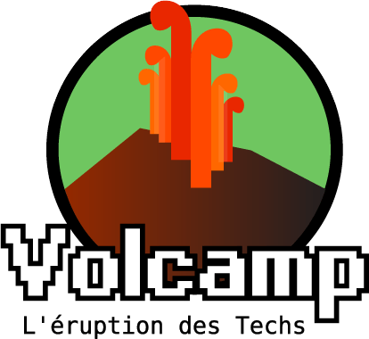
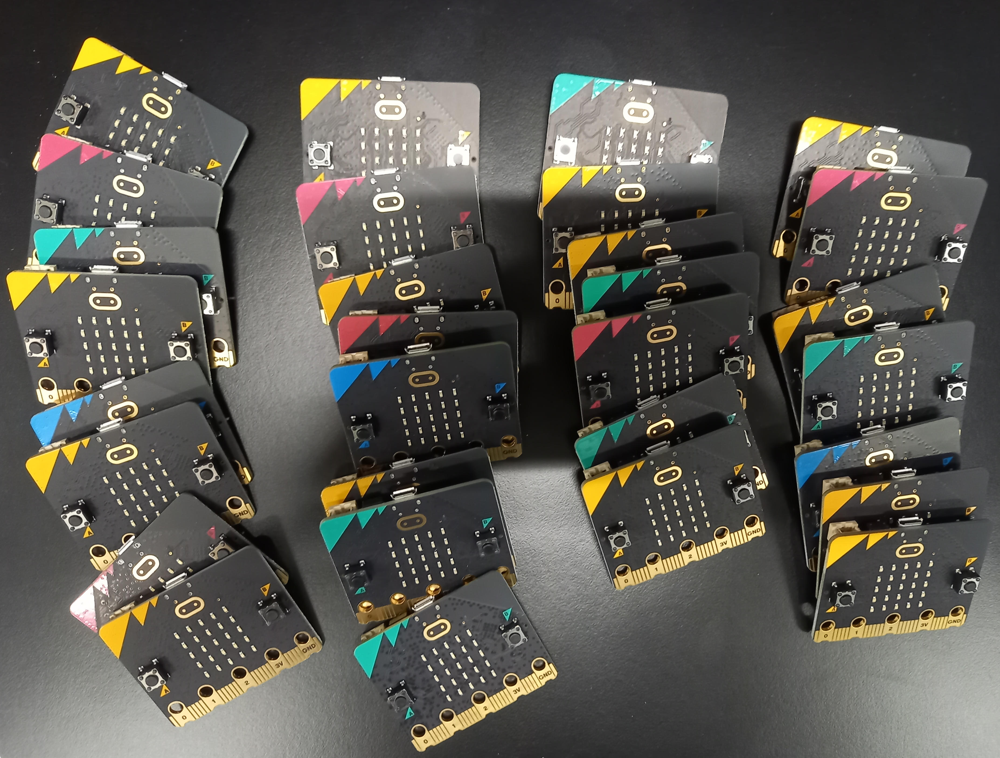

# Atelier micro:bit Volcamp 2025

[Plateforme de développement](https://makecode.microbit.org/)

[Support de présentation](./presentation_volcamp_2025.pdf)

L'atelier se décompose en plusieurs parties : 
* Une présentation de la carte micro:bit. 
* [Découvrir le langage bloc](./exercice_bloc.md)
* Démo : [Katas pour se perfectionner](https://github.com/jotitan/microbit-tests-kata) : plusieurs exercices basiques
* [Icones radio](https://github.com/jotitan/microbit-radio-icons) : envoi d'icônes par radio
* [La bille qui roule](https://github.com/jotitan/microbit-rolling-ball) : incliner la carte pour déplacer la bille
* [Tu chauffes, tu brules](https://github.com/jotitan/microbit-burn-cold-game) : trouver des balises cachées

