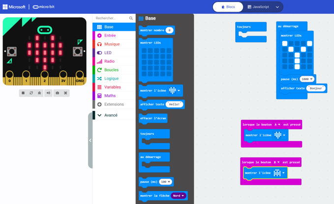

# Découvrir la programmation

L'objectif est de manipuler le langage bloc comme un enfant.
A travers ces exercices, vous aller découvrir l'interface, les fonctions utilisables, le langage bloc. Puis vous testerez rapidement le résultat grâce au simulateur
## Etapes
* Au démarrage, afficher une icône de coeur
* Quand on appuie sur le bouton A, incrémenter un compteur et l'afficher
* Quand on appuie sur le bouton B, réduire ce compteur et l'afficher
* Quand on appuie sur les deux boutons, remettre le compteur à 0 et l'afficher

